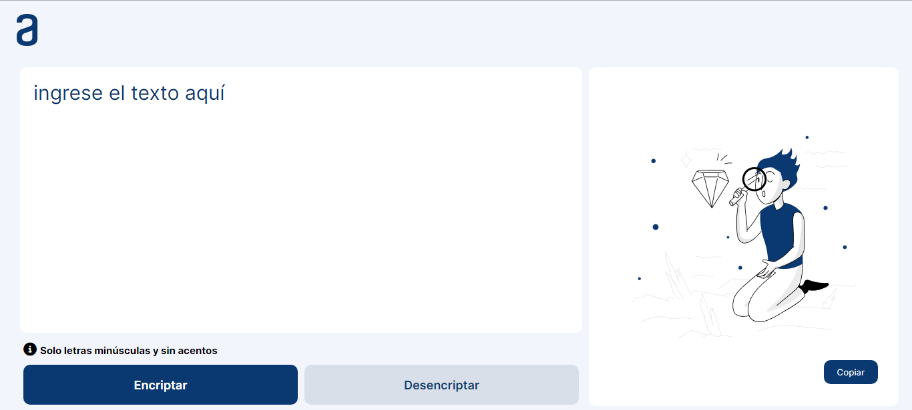

# Encriptador de Texto

## Challenge ONE Sprint 01:

Construye un encriptador de texto con Javascript

Se muestra un encriptador de texto que permite el ingreso de cadenas en letras minusculas y dando click lo encripta, mostrandolo en una segunda textArea, de igual manera permite hacer el proceso inverso por medio del botón desencriptar.

Las "llaves" de encriptación que se utilizaron son las siguientes:

- La letra "e" es convertida para "enter"
- La letra "i" es convertida para "imes"
- La letra "a" es convertida para "ai"
- La letra "o" es convertida para "ober"
- La letra "u" es convertida para "ufat"
